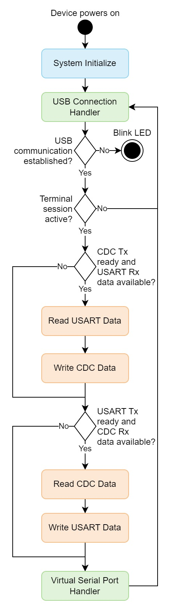

<!-- Please do not change this logo with link -->

[](https://www.microchip.com)

# USB CDC to USART Bridge Using AVR® DU Microcontroller
This example shows how to use the AVR DU microcontroller as a bridge to other peripherals. The attached application uses the Universal Synchronous Asynchronous Receiver-Transmitter (USART) peripheral to exemplify this. In addition to an application that will work with standard terminal applications, a python script is included showing how to easily interface with the AVR DU using the Communications Device Class (CDC).

## Related Documentation
- [AVR® DU Family Product Page](https://www.microchip.com/en-us/products/microcontrollers-and-microprocessors/8-bit-mcus/avr-mcus/avr-du?utm_source=GitHub&utm_medium=TextLink&utm_campaign=MCU8_AVR-DU&utm_content=avr64du32-cnano-usb-cdc-to-usart-bridge-mplab-mcc-github&utm_bu=MCU08)
- [USB CDC Virtual Serial Port using AVR DU Microcontroller](https://github.com/microchip-pic-avr-examples/avr64du32-cnano-usb-cdc-virtual-serial-port-mplab-mcc.git)
- [USB CDC Specification](https://www.usb.org/document-library/class-definitions-communication-devices-12)

## Software Used
- [MPLAB® X IDE 6.20.0](https://www.microchip.com/en-us/development-tools-tools-and-software/mplab-x-ide?utm_source=GitHub&utm_medium=TextLink&utm_campaign=MCU8_MMTCha_MPAE_Examples&utm_content=avr64du32-cnano-usb-cdc-virtual-serial-port-mplab-mcc-github) or newer
- [MPLAB® XC8 2.46.0](https://www.microchip.com/en-us/development-tools-tools-and-software/mplab-xc-compilers?utm_source=GitHub&utm_medium=TextLink&utm_campaign=MCU8_MMTCha_MPAE_Examples&utm_content=avr64du32-cnano-usb-cdc-virtual-serial-port-mplab-mcc-github) compiler or newer
- [MPLAB® Code Configurator (MCC) v5.5.0](https://www.microchip.com/en-us/tools-resources/configure/mplab-code-configurator?utm_source=GitHub&utm_medium=TextLink&utm_campaign=MCU8_AVR-DU&utm_content=avr64du32-cnano-usb-cdc-to-usart-bridge-mplab-mcc-github&utm_bu=MCU08) plug-in or newer
- [PuTTY 0.81](https://www.chiark.greenend.org.uk/~sgtatham/putty/latest.html) or newer
- [Python 3.11.0](https://www.python.org/) or newer

## Hardware Used
- [AVR64DU32 Curiosity Nano](https://www.microchip.com/en-us/development-tool/EV59F82A)

## Setup 

### Physical Setup
The AVR DU Curiosity Nano Development Board has two USB-C® ports. One for programming the device via the on-board debugger and one connected directly to the AVR DU. While programming the device over the AVR DU's port is possible using bootloaders, this example uses the debugger port, so both ports need to be connected to the host computer. After programming, the debugger port is used for serial communication to close the loop and needs to remain connected. One of the AVR DU's USART peripherals is directly connected to the debugger CDC pins, allowing the entire bridge application to be showcased on the development board. 

The Curiosity Nano has an Adjustable Target Regulator that regulates voltage to 3.3V by default. Since the USB peripheral in the AVR64DU32 needs to run at 3.3V, it either needs a 3.3V supply connected on the VUSB pin or a 5.0V supply on VDD with the internal USB Voltage Regulator active. With the Curiosity Nano default settings, the VBUS pinheader on the board must be connected with the included jumper to supply 3.3V directly to VUSB.

### MCC Setup
This section shows how the example is set up in MPLAB using MCC. An overview of the complete MCC setup is shown in the image below:
<p></p>

1. Start a new Microchip Embedded Application Project in MPLAB, selecting the AVR DU as your device.
2. Open MCC to start setting up the USB Device Stack:
    * If the USB library doesn’t show up in Libraries under Device Resources (by default on the left in MPLAB), it needs to be added in the Content Manager menu. The button is in the Device Resources section or under Tools in the menu.
3. Add the USB Device Stack library to the project.
4. Add the USART, AC0, RTC and VREF drivers to the project.
5. Follow the setup below to configure the library and drivers.

#### USB General Settings
The configurator is set so that the AVR DU will identify as a CDC device on the highest level. The toggle switch for adding the Virtual Serial example code is also enabled.
<p></p>

#### USB Device Descriptors
For this example, the Device Descriptors section is left as default. For other applications, information on the product can be added here.
<p></p>

#### USB Interfaces
For this example, both a communication and data interface are required.
<p></p>

#### USB CDC Communication Interface
The communication interface determines how the communication flow between the host and device. The Abstract Control Model (ACM) is used as a subclass but few of the supported commands are needed. Three Functional Descriptors are also required:
* Header - Required for Functional Descriptors
* ACM - Tells the host what commands the device supports (D1 indicates that device supports basic Line Coding and Control Line State commands needed for terminal applications)
* Union - Tells the host the relationship between two or more interfaces
<p></p>

### USB CDC Data Interface
All communication is sent over the data interface for this basic Virtual Serial Port application. The Packet Size field determines how much data can be transmitted in one USB packet. The data sent can be bigger or smaller and the stack will transmit a less amount or split it up in smaller packages.
<p></p>

### USART 
General settings for the USART can be seen below. The specific settings is not important, but must match what is set in the terminal session for the USART. If large amount of data is being transmitted the baud rate should match between the USART and CDC session to avoid buffer overflow.
<p></p>

> 🛈 Info: The on-board debugger of the Curiosity Nano limits its baud rate to about 500 kbaud. Because of this, it is also the limit for the AVR DU in this example. If implemented without the development board this limit is removed.

USART hardware and interrupt settings should be set by the settings above but should for reference be like the picture below.
<p></p>

To set the pins for the USART as in- and output the corresponding fields are clicked in the Pin Grid View. These pins need to match the Curiosity Nano debuggers CDC pins for the example to work.
<p></p>

### Device Clock Setup
This example is configured to run on 24 MHz. The minimum oscillator frequency for USB on the AVR DU is 12 MHz.
<p></p>

The application uses a delay function to blink an LED if the USB connection fails. This delay function is dependent on knowing the main clock speed through the F_CPU define. Here, this has been set up as a preprocessed define macro in the project settings, as seen in the image below.

<p></p>

Alternatively, it could have been added in the main file as `#define F_CPU 24000000UL` above the `#include <util/delay.h>` line.

### USB Voltage Detection Setup
To ensure that the USB peripheral only tries to attach to the bus when the Curiosity Nano is connected to the PC, the Analog Comparator will periodically check if the voltage is within the acceptable range for V<sub>BUS</sub>.

#### Voltage Reference Setup
In the V<sub>REF</sub> peripheral, the Voltage Reference is set to 2.048V.
<p></p>

#### Analog Comparator Setup (AC)
The Analog Comparator must be enabled by toggling Enable under Hardware Settings.

The positive input is set to the USB DETECT pin on the Curiosity Nano which is connected to Positive Pin 4 on the AC by default. The detection threshold is set using the internal reference voltage generator (DACREF) which is selected as the negative input to the AC.

To calculate the DACREF, use the formula from the data sheet:

*V_DACREF = (DACREF / 256) * V_REF*

Due to the voltage divider present on the Curiosity Nano, a threshold of 0.32V is needed for this project. Inputting this value into the Requested Voltage field in MCC can calculate the DACREF value automatically.

Refer to the [AVR64DU32 Curiosity Nano User Guide](https://ww1.microchip.com/downloads/aemDocuments/documents/MCU08/ProductDocuments/UserGuides/AVR64DU32-Curiosity-Nano-UserGuide-DS50003671.pdf) for more information on how the *USB DETECT* is implemented on the Curiosity Nano.

<p></p>

### RTC Setup
The RTC Periodic Interrupt Timer (PIT) is used to trigger the voltage detection described above. 

#### RTC Hardware Settings
The RTC is configured to run on a 1 kHz clock with no prescaler.
<p></p>

#### RTC Interrupt Settings
The PIT is then set to trigger at every 32 clock cycles of the RTC clock. this gives an update rate of ~31 Hz.
<p></p>

The application is set up to need five stable voltage readings before initiating the USB communication. This means that, with no voltage fluctuations and the settings above, the start-up time will be in the 0.16s range.

### LED Setup
The on-board LED of the Curiosity Nano is used to indicate if the USB communications has failed. The LED is connected to the PF1 pin and can be selected as an output in the Pin Grid View as seen in the USART section of this guide. The pin is given a custom name in the Pins menu, as seen below. This makes the code easier to read with function generated using this name.

<p></p>

### Global Interrupts
Since this example uses interrupts both for voltage monitoring and for USART communication, global interrupt must be enabled in the Interrupt Manager.

<p></p>

### Application
The included application is set up to pass data between the USB peripheral and a USART peripheral.

The USART driver is implemented using the standard driver included in MCC with interrupts enabled, this includes a circular buffer like the one used in the CDC class. This enables a similar interface for both CDC and USART and simplifies the flow of the application. 

The application checks if the receiving peripheral is ready and has space in its buffer before attempting to read data from the transmitting peripherals buffer. If the read is successful, it will write the received data to the receiving peripherals buffer. This will be done in both directions before the application calls the handlers for both peripherals. The USB handler is called for each iteration of the application loop to handle the actual communication to the host. The full flow of the main application can be seen in the diagram below.

<p></p>

The USB part of the application is set up in polling mode and therefore needs to handle the USB peripheral inside the main loop. Interrupt mode is also selectable in MCC and it simplifies the application by removing the need for USB handler. 

This example is set up for the USART peripheral, but the main application would support any other communication peripheral by simply adding a driver using buffers and changing the function calls in the main application.

### Identify Virtual Serial Port Number
When the device is programmed, it will show up as a Virtual Serial Port on the host. The method varies between operating systems and the most common cases are listed below.

#### Windows®
In Windows, the easiest way to identify the port number is to go to *Device Manager>Ports (COM and LPT)* to easily identify the port number.. The device shows up as USB Serial Device (COM##), where ## is the number assigned by the host.

Alternatively, the following commands will also list the devices in terminal.

Command Prompt:
```
reg query HKLM\HARDWARE\DEVICEMAP\SERIALCOMM
```

PowerShell:
```
Get-WMIObject Win32_SerialPort | Select-Object Name,DeviceID,Description
```

#### macOS® and Linux®
Using the terminal, add the command below to generate a list of connected devices.

```
ls /dev/tty.*
```

## Operation
This section assumes that the setup has been followed and that the device is programmed and connected to the host.

### PuTTY
The application takes advantage of the two USB connectors on the AVR DU Curiosity Nano. Because of this, two terminal sessions can be started simultaneously on the development board. After identifying the two virtual serial ports described in the last section, start terminal sessions with the default settings in both. The connection type needs to be serial and the port numbering is added in the Serial line field. Finally, use `115200` as the speed value and click **Open**. If the baud rate is changed for the USART peripheral, the value must be changed here as well.

<p></p>

> 🛈 Info: Note that the baud rate should match between the terminal sessions to avoid buffer overflow.

By opening both terminal sessions, a live updating bridge will be active. Writing in one will show up in the other with no echo active.

<p></p>

In this mode, all valid keys will work over the terminal. This includes backspace, enter and arrow keys. 

Using other settings for the PuTTY sessions will give different behaviors, such as transmitting on return or automatic echo.

### Python® Script
Communicating between two terminal windows is not always the most useful way to use the bridge. Communicating between two terminal windows is not always the most useful way to use the bridge. This section demonstrate an alternative, more efficient way of transmitting and receiving data using a Python script.

In addition to basic packages included by the standard Python installation, the script also uses [pyserial](https://pypi.org/project/pyserial/) that needs to be installed separately.

```
pip install pyserial
```

The included script is quite sparse and is only meant to show the basic functionality. While both Curiosity Nanos USB ports are connected and the device is programmed as described in the previous example, running the script is done using the following command:

```
python usb_cdc_usart_bridge.py
```
The python prefix depends on the installed Python version and setup.

Running the script will print a status message for trying to open the serial communication on both ports:

```
Opening serial communication...
``` 

When communication is established, it will transmit a preset array of values to the AVR DU and print the following:

```
Transmitting Data USB->USART:
<data transmitted as hex values>
```

The script will then attempt to read from the Debugger using the number of transmitted bytes as a limit on how many bytes to read. It will then print the received bytes in ASCII form:

```
Received Data:
b'<data received as ASCII characters>'
```

Now the script will run and transmit the same data in reverse, showing that the formatting works the same both ways for Python Serial. Python's `serial.read()` interprets the returned values as ASCII text, resulting in an array of chars instead of numbers. In the example script, this has been used directly, but if the values are to be used in another format, the read data must be converted.

Finally, the script will close the serial communication as not to hold up the device for other use.

```
Closing the serial communication.
```

The script itself will try to identify the connected Virtual Serial Port number using the VID and PID used in the MCC setup. If it throws an error, or the VID or PID is changed, the script has two optional arguments (`-s` and `-d`) that can be used to input the number. This is exemplified below:

```
python usb_cdc_virtual_serial_port.py -s COM10 -d COM5
```

## Summary
By following this example, the user will:
1. Understand the basics of using the AVR DU as a bridge between USB and other protocols.
2. Be able to create simple applications where CDC is the communication protocol between host and device.