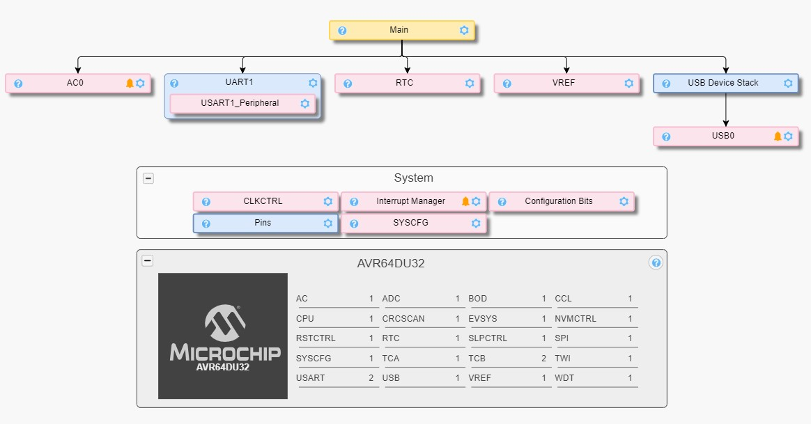
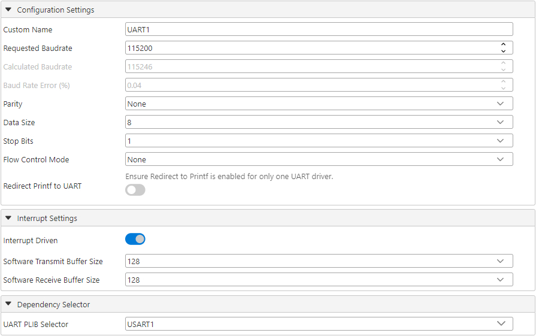
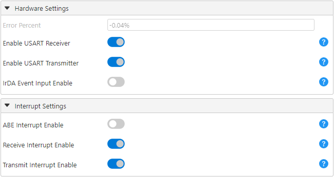
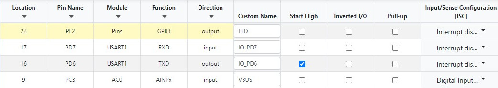

<!-- Please do not change this logo with link -->

[](https://www.microchip.com)

# USB CDC to USART Bridge Using AVR® DU Microcontroller
This example shows how to use USB communication with the AVR DU microcontroller as a bridge to other serial peripherals. The attached application uses the Universal Synchronous Asynchronous Receiver Transmitter (USART) peripheral to exemplify this. In addition to an application that will work with standard serial and terminal applications, a Python® script is included showing how to easily interface with the AVR DU using the Communications Device Class (CDC).

<p></p>

## Related Documentation
- [AVR® DU Family Product Page](https://www.microchip.com/en-us/products/microcontrollers-and-microprocessors/8-bit-mcus/avr-mcus/avr-du?utm_source=GitHub&utm_medium=TextLink&utm_campaign=MCU8_AVR-DU&utm_content=avr64du32-cnano-usb-cdc-to-usart-bridge-mplab-mcc-github&utm_bu=MCU08)
- [USB CDC Virtual Serial Port using AVR DU Microcontroller](https://github.com/microchip-pic-avr-examples/avr64du32-cnano-usb-cdc-virtual-serial-port-mplab-mcc.git)
- [USB CDC Specification](https://www.usb.org/document-library/class-definitions-communication-devices-12)

## Software Used
- [MPLAB® X IDE 6.20.0](https://www.microchip.com/en-us/development-tools-tools-and-software/mplab-x-ide?utm_source=GitHub&utm_medium=TextLink&utm_campaign=MCU8_MMTCha_MPAE_Examples&utm_content=avr64du32-cnano-usb-cdc-virtual-serial-port-mplab-mcc-github) or newer
- [MPLAB® XC8 2.46.0](https://www.microchip.com/en-us/development-tools-tools-and-software/mplab-xc-compilers?utm_source=GitHub&utm_medium=TextLink&utm_campaign=MCU8_MMTCha_MPAE_Examples&utm_content=avr64du32-cnano-usb-cdc-virtual-serial-port-mplab-mcc-github) compiler or newer
- [MPLAB® Code Configurator (MCC) 5.5.0](https://www.microchip.com/en-us/tools-resources/configure/mplab-code-configurator?utm_source=GitHub&utm_medium=TextLink&utm_campaign=MCU8_AVR-DU&utm_content=avr64du32-cnano-usb-cdc-to-usart-bridge-mplab-mcc-github&utm_bu=MCU08) plug-in or newer
- [PuTTY 0.81](https://www.chiark.greenend.org.uk/~sgtatham/putty/latest.html) or newer
- [Python 3.11.0](https://www.python.org/) or newer

## Hardware Used
- [AVR64DU32 Curiosity Nano](https://www.microchip.com/en-us/development-tool/EV59F82A)

## Setup 

### Physical Setup
The AVR DU Curiosity Nano Development Board has two USB-C® ports as shown in the image below. One for programming the device via the on-board debugger and one connected directly to the AVR DU. While programming the device over the AVR DU's port is possible using bootloaders, this example uses the debugger port, so both ports need to be connected to the host computer. After programming, the debugger port is used for serial communication to close the loop and needs to remain connected. The AVR DU's USART1 peripheral is directly connected to the debugger's CDC pins, allowing the entire bridge application to be showcased on the development board.


The Curiosity Nano has an Adjustable Target Regulator that regulates voltage to 3.3V by default. Since the USB peripheral in the AVR64DU32 needs to run at 3.3V, it either needs a 3.3V supply connected on the V<sub>USB</sub> pin or a 5.0V supply on V<sub>DD</sub> with the internal USB Voltage Regulator active. With the Curiosity Nano's default settings, the V<sub>BUS</sub> pinheader on the board must be connected with the included jumper to supply 3.3V directly to V<sub>USB</sub>. This example uses the default settings, requiring the jumper as shown in the image below.

<p></p>

### MCC Project Setup
This section shows how the example is set up in MPLAB® using MCC. An overview of the complete MCC setup is shown in the image below:

<p></p>

1. Start a new Microchip Embedded Application Project in MPLAB and select the AVR DU as the device.
2. Open MCC and select *Add Component*>*Library*>*USB Device Stack*.
    * If the USB Device Stack does not show up, the library needs to be added in the Content Manager (CM) menu. The button for the CM menu is in the Device Resources section (by default on the left in MPLAB) or under Tools in the menu.
3. Select **Add Component**, enable the API filter and add the UART, AC0, RTC and VREF application interfaces (APIs) to the project.
4. Follow the setup below to configure the library and APIs.

#### USB Device Stack Setup
##### USB General Settings
The configurator is set so that the AVR DU will identify as a CDC device on the highest level. The toggle switch for adding the Virtual Serial example code is also enabled.
<p></p>

##### USB Device Descriptors
For this example, the Device Descriptors section is left as default. For other applications, information on the product can be added here.
<p></p>

##### USB Interfaces
For this example, both a communication and data interface are required.
<p></p>

##### USB CDC Communication Interface
The communication interface determines the communication flow between the host and device. The Abstract Control Model (ACM) is used as a subclass but few of the supported commands are needed. Three functional descriptors are also required:
* Header - Required for functional descriptors
* ACM - Tells the host what commands the device supports (D1 indicates that device supports basic Line Coding and Control Line State commands needed for terminal applications)
* Union - Informs the host of the relationship between two or more interfaces
<p></p>

##### USB CDC Data Interface
All communication is sent over the data interface for this basic Virtual Serial Port application. The Packet Size field determines how much data can be transmitted in one USB packet. The data sent can be bigger or smaller and the stack will transmit a less amount or split it up in smaller packages.
<p></p>

#### USART Setup
Select USART1 from the drop-down menu in the UART Selector. After the selection, the **UART(None)** tab will automatically become the **UART1** configuration tab.
<p></p>

General USART settings are shown below. While the specific settings are not important, they must match the terminal session configuration. If large amounts of data are being transmitted, the baud rate for the USART has to match the CDC rate to avoid buffer overflow.
<p></p>

> 🛈 Info: The on-board debugger of the Curiosity Nano limits its baud rate to about 500 kbaud. Consequently, this is also the limit for the AVR DU in this example. If implemented without the development board, this limit is removed.

In the USART1_Peripheral, the hardware and interrupt settings are set automatically by configuring the settings above. For reference, this is the correct configuration:
<p></p>

To set the pins for the USART as in- and output, the corresponding fields need to be selected in the **Pin Grid View**. These pins need to match the Curiosity Nano debuggers CDC pins for the example to work.
<p></p>

#### LED Setup
The on-board LED of the Curiosity Nano is used to indicate if the USB communications has failed. The LED is connected to the PF2 pin and can be selected as an output in the Pin Grid View as seen in the USART section of this guide. The pin is given a custom name in the Pins menu, which makes the code easier to read.

<p></p>

#### Device Clock Setup
This example is configured to run on 24 MHz. The minimum oscillator frequency for USB on the AVR DU is 12 MHz.
<p></p>

The application uses a delay function to blink an LED if the USB connection fails. This delay function is dependent on knowing the main clock speed through the F_CPU define. To set up a pre-processed define macro, right click the project name in MPLAB, go to Properties and define the macro.

<p></p>

Alternatively, the macro can be added in the main file as `#define F_CPU 24000000UL` above the `#include <util/delay.h>` line.

#### USB Voltage Detection Setup
To ensure that the USB peripheral only tries to attach to the bus when the Curiosity Nano is connected to the PC, the Analog Comparator (AC) will be checked periodically if the voltage is within the acceptable range for V<sub>BUS</sub>.

##### Voltage Reference Setup
In the V<sub>REF</sub> peripheral, the Voltage Reference is set to 2.048V.
<p></p>

##### Analog Comparator Setup (AC)
The Analog Comparator should be enabled by default in the Hardware Settings.

The positive input is set to the USB DETECT pin on the Curiosity Nano which is connected to positive pin 4 on the AC by default. The detection threshold is set using the internal reference voltage generator (DACREF) as the negative input to the AC.

The Curiosity Nano has a voltage divider that determines the threshold for detecting the presence of USB voltage. Set the threshold voltage to 0.32V. The DACREF value will be calculated automatically using this formula provided in the [data sheet](https://onlinedocs.microchip.com/oxy/GUID-3E14380F-9711-4707-8991-A4DB432DDBE5-en-US-6/GUID-AD554004-D7B0-442A-BEB7-D479D093FB95.html):

*V<sub>DACREF</sub> = (DACREF / 256) * V<sub>REF</sub>*

Refer to the [AVR64DU32 Curiosity Nano User Guide](https://ww1.microchip.com/downloads/aemDocuments/documents/MCU08/ProductDocuments/UserGuides/AVR64DU32-Curiosity-Nano-UserGuide-DS50003671.pdf) for more information on how the USB DETECT is implemented on the Curiosity Nano.

<p></p>

#### RTC Setup
The RTC Periodic Interrupt Timer (PIT) is used to trigger the voltage detection described above. 

##### RTC Hardware Settings
The RTC is configured to run on a 1 kHz clock with no prescaler.
<p></p>

##### RTC Interrupt Settings
The PIT is then set to trigger at every 32 clock cycles of the RTC clock, which gives an update rate of ~31 Hz.
<p></p>

The application is set up to need five stable voltage readings before initiating the USB communication.  Considering the previous settings and an environment with no voltage fluctuations, the start-up time is in the 0.16s range.

#### Global Interrupts
This example uses interrupts for both voltage monitoring and for USART communication. Go to the Interrupt Manager module and enable global interrupts.

<p></p>

### Programming the AVR®

1. Download the zip file or clone the example to get the source code.
2. Open the ``.X`` project from the source code with the MPLAB® X IDE. Another option is to create a new MPLAB® X project and follow the MCC Setup:
    - In a new project, open MCC and complete the MCC setup, as explained previously in this document
    - Go to the **Resource Management** tab and click **Generate** under Project Resources, to generate the code. 
    - Replace the empty ``main.c`` file with the main from the source code
    - The current USB driver has an echo functionality implemented by default. To remove this, go to the ``usb/usb_cdc/usb_cdc_virtual_serial_port.c`` file. Find the ``USB_CDCDataReceived()`` function and comment out the ``USB_TransferWriteStart()`` function call (line 150):

    <p>

3. Program the project to the AVR64DU32 Curiosity Nano: 
    - First clean and build the project by pressing the **Clean and Build Main Project** button
    
    <p>

    - Then make and program the project to the AVR64DU32 by clicking the **Make and Program Device Main Project** button
    
    <p>


## Application Flow
The application is set up to pass data between the USB peripheral and a USART peripheral. 

The USART driver is implemented using the standard driver included in MCC with interrupts enabled, which includes a circular buffer like the one used in the CDC class. This enables a similar interface for both CDC and USART and simplifies the flow of the application. This example is set up for the USART peripheral, but the main application would support any other communication peripheral, by simply adding a driver using buffers and changing the function calls in the main application.

The application ensures the receiving peripheral is ready and has space in its buffer before attempting to read data from the transmitting peripheral's buffer. If the read is successful, the received data is written to the receiving peripheral's buffer. This process is performed in both directions. The USB part of the application is set up using polling and is therefore called during each iteration of the application loop to manage the communication with the host. Alternatively, Interrupt Driven USB can be selected in the MCC configuration, simplifying the application by removing the need for a USB handler. The complete flow of the main application is shown in the diagram below.

<p>

### Identify Virtual Serial Port Number
When the device is programmed, it will show up as a Virtual Serial Port on the host. The method to identify the Virtual Serial Port varies between operating systems and the most common cases are listed below.

#### Windows®
In Windows, the easiest way to identify the port number is to go to *Device Manager>Ports (COM and LPT)*. The device shows up as a USB Serial Device (COM##), where ## is the number assigned by the host.

Alternatively, the following commands will also list the devices in terminal.

Command Prompt:
```
reg query HKLM\HARDWARE\DEVICEMAP\SERIALCOMM
```

PowerShell:
```
Get-WMIObject Win32_SerialPort | Select-Object Name,DeviceID,Description
```

#### macOS® and Linux®
Using the terminal, add the command below to generate a list of connected devices.

```
ls /dev/tty.*
```

## Operation
This section assumes that the setup has been followed and that the device is programmed and connected to the host.

### PuTTY
The application takes advantage of the two USB connectors on the AVR DU Curiosity Nano. Because of this, two terminal sessions can be started simultaneously on the development board.

1. Configure and program the device.
2. Connect both the Curiosity Nano's USB ports to the computer.
3. Open two PuTTY terminal sessions, one for each USB port.
4. Configure the terminal windows to match the USB/USART setup:
    * Identify the two virtual serial ports and add the port numbering in the Serial line field
    * Set the speed (baud rate) to `115200`
    * Select the **Serial** connection type
5. Click **Open** to start the terminal sessions.
6. Input to one terminal will appear in the other.

<p></p>

> 🛈 Info: Note that the baud rate should match between the two terminal sessions to avoid buffer overflow. If the USART peripheral is configured to a different baud rate, the PuTTY configuration must be updated to match this speed.

By opening both terminal sessions, a live updating bridge will be active. Writing in one will show up in the other with no echo active.

<p></p>

In this mode, all valid keys will work over the terminal. This includes Backspace, Enter and arrow keys. 

Using other settings for the PuTTY sessions will give different behaviors, such as transmitting on return or automatic echo.

### Python® Script
Communicating between two terminal windows is not always the most practical way to use the bridge. This section demonstrates a more efficient method for transmitting and receiving data using a Python script.

1. Configure and program the device.
2. Install the [pyserial](https://pypi.org/project/pyserial/) Python extension.
    ```
    pip install pyserial
    ```
3. Connect both Curiosity Nano's USB ports to the computer.
4. Run the provided Python script and see the results.
    ```
    python usb_cdc_usart_bridge.py
    ```

The included script is quite sparse and is only meant to show the basic functionality. Note that the python prefix used when running the script depends on the installed Python version and setup.

Running the script will print a status message for trying to open the serial communication on both ports:

```
Opening serial communication...
``` 

When communication is established, it will transmit a preset array of values to the AVR DU and print the following:

```
Transmitting Data USB->USART:
<data transmitted as hex values>
```

The script will then attempt to read from the Debugger using the number of transmitted bytes as a limit on how many bytes to read. It will then print the received bytes in ASCII form:

```
Received Data:
b'<data received as ASCII characters>'
```

Now the script will run and transmit the same data in reverse, showing that the formatting works the same both ways for Python Serial. Python's `serial.read()` interprets the returned values as ASCII text, resulting in an array of chars instead of numbers. In the example script, this has been used directly, but if the values are to be used in another format, the read data must be converted.

Finally, the script will close the serial communication so as not to hold up the device for other use.

```
Closing the serial communication.
```

The script itself will try to identify the connected Virtual Serial Port number using the VID and PID in the MCC setup. If it throws an error or the VID or PID is changed, the script has two optional arguments (`-s` and `-d`) that can be used to input the number. This is exemplified below:

```
python usb_cdc_usart_bridge.py -s COM10 -d COM5
```

## Summary
By following this example, the user will:
1. Understand the basics of using the AVR DU as a bridge between USB and other protocols.
2. Be able to create simple applications where CDC is the communication protocol between host and device.
